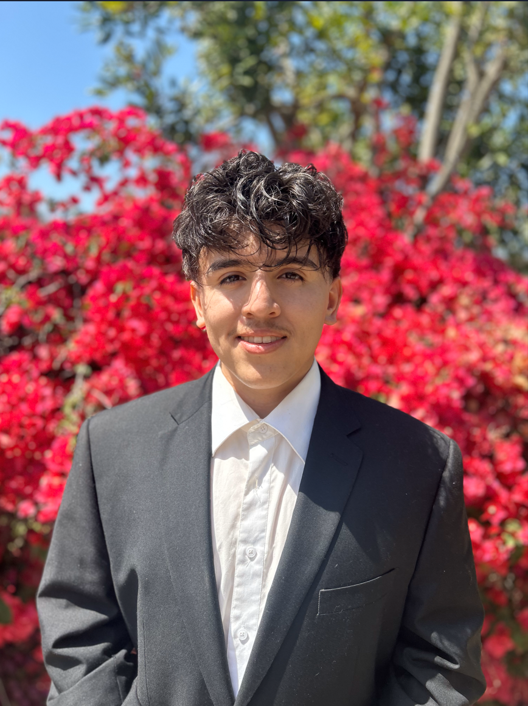

<!-- THINGS TODO -->
<!--This is where you'll create your User Page, which should include content that introduces who you are as a programmer and as a person. -->

# Moises Mendoza

### ABOUT ME: 
Currently attending University of California San Diego studying for a BA in Computer Science. I found a passion for software development and project creation as I enjoy coding up solutions to certian issues. I plan to continue with my passion in real world application helping solve real world issues. Outside of software development, interests of mine include, personal bodybuilding in the gym, dancing, and playing the guitar. Finally one past time I enjoy the most would be the going to the beach😎.

### Link to other [Projects](https://github.com/MoisesRM32/spis23-finalproject-Eduardo-Moises.git).
